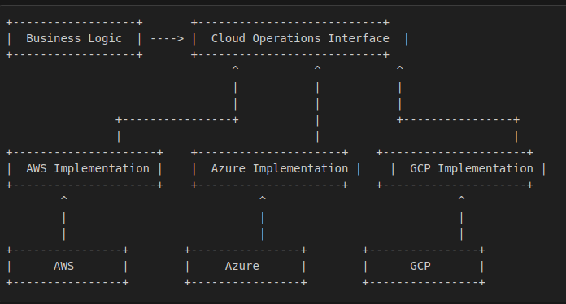

# Don't Compile Your Business Code Over Cloud Provider's Change: Building Cloud-Agnostic Applications with Dependency Inversion

## Introduction

In today’s multi-cloud world, businesses often need to switch cloud providers or use multiple providers simultaneously. However, tightly coupling your application to a specific cloud provider’s SDK can lead to vendor lock-in and make migrations costly and time-consuming. In this article, we’ll explore how to build cloud-agnostic applications using dependency inversion, ensuring that your business logic remains unchanged even if the cloud provider changes.

## What is Dependency Inversion?

Dependency inversion is a principle of the SOLID design principles. It states:

- High-level modules should not depend on low-level modules. Both should depend on abstractions.
- Abstractions should not depend on details. Details should depend on abstractions.

In the context of cloud-agnostic applications:

- Your business logic (high-level module) should depend on generic interfaces (abstractions) for cloud operations.
- Cloud-specific implementations (low-level modules) should depend on the same interfaces.

## Benefits of This Approach

- **No Vendor Lock-In**:
  - By depending on abstractions, your application is not tied to any specific cloud provider.
  - Switching cloud providers requires only changing the implementation module, not the business logic.
- **Reusability**:
  - The `cloud-agnostic-api` library can be reused across multiple projects, reducing duplication of effort.
- **Testability**:
  - You can easily mock the interfaces for unit testing, ensuring your business logic is tested independently of cloud providers.
- **Extensibility**:
  - Adding support for a new cloud provider is as simple as creating a new implementation module.
- **Separation of Concerns**:
  - Business logic is decoupled from cloud-specific details, making the codebase cleaner and easier to maintain.

## Drawbacks of This Approach

- **Initial Complexity**:
  - Setting up abstractions and interfaces can introduce initial complexity and require more upfront design effort.
- **Maintenance**:
  - Maintaining multiple implementations for different cloud providers can increase the maintenance burden.

## How Our Media Service is Built Using This Approach

Our media service is designed to be cloud-agnostic by following the dependency inversion principle. Here is a high-level overview of the architecture and flow:

1. **Business Logic Layer**:
   - This layer contains the core business logic of the media service, such as media processing, media upload and etc.

2. **Abstraction Layer: cloud-agnostic-api**:
   - This layer defines the generic interfaces for cloud operations.
   - Interfaces include methods for dealing with storage, send/receive messages with message borkers.
   - Keeping the abstraction layer as a separate library (`cloud-agnostic-api`), allows the interfaces to be reused across multiple projects. If we were to keep this layer within the project itself, it would limit its usability to only that specific project and prevent other projects from leveraging the same abstractions.

3. **Cloud-Specific Implementations (Ex: gcp-cloud-sdk)**:
   - This layer contains implementations of the generic interfaces for specific cloud providers (e.g., AWS, Azure, GCP).
   - Each implementation interacts with the respective cloud provider's SDK to perform the required operations.

### Flow Diagram

### Example Flow

1. **Upload Media**:
   - The business logic layer calls the `uploadFile` method on the cloud operations interface.
   - The abstraction layer forwards the call to the appropriate cloud-specific implementation based on the dependency provided.
   - The cloud-specific implementation uses the cloud provider's SDK to upload the media/file to the cloud storage.

## Comparison with Spring Cloud

Spring Cloud is another way of achieving cloud-agnostic behavior. It provides tools for developers to quickly build some of the common patterns in distributed systems.

For more information, visit the [Spring Cloud  project](https://spring.io/projects/spring-cloud).

However, it will not cover all use cases, especially for advanced or provider-specific features.

### Pros of Using Spring Cloud

- **Built-In Abstractions**:
  - Spring Cloud provides ready-to-use abstractions for common cloud-native patterns (e.g., configuration, event driver).
- **Reduced Boilerplate**:
  - Spring Cloud handles much of the boilerplate code, allowing you to focus on business logic.
- **Ecosystem Integration**:
  - Spring Cloud integrates seamlessly with other Spring projects (e.g., Spring Boot, Spring Security).

### Cons of Using Spring Cloud

- **Limited Flexibility**:
  - Spring Cloud’s abstractions may not cover all use cases, especially for advanced or provider-specific features.
- **Learning Curve**:
  - Spring Cloud introduces additional complexity, requiring developers to learn its conventions and configurations.
- **Dependency on Spring Ecosystem**:
  - Using Spring Cloud ties your application to the Spring ecosystem, which may not be desirable in all scenarios.

## When to Use Dependency Inversion vs. Spring Cloud

- **Use Dependency Inversion Approach**:
  - When you need full control over the abstractions and implementations.
  - When you want to avoid dependencies on third-party libraries.
  - When you plan to support multiple cloud providers and want to ensure portability.
- **Use Spring Cloud**:
  - When you want to reduce boilerplate code and speed up development.
  - When you don’t need advanced or provider-specific features.

## Conclusion

By using dependency inversion, you can build cloud-agnostic applications that are flexible, maintainable, and free from vendor lock-in. While Spring Cloud offers a convenient way to achieve cloud-agnostic behavior, it may not always be the best fit for every use case. Ultimately, the choice depends on your specific requirements and constraints.